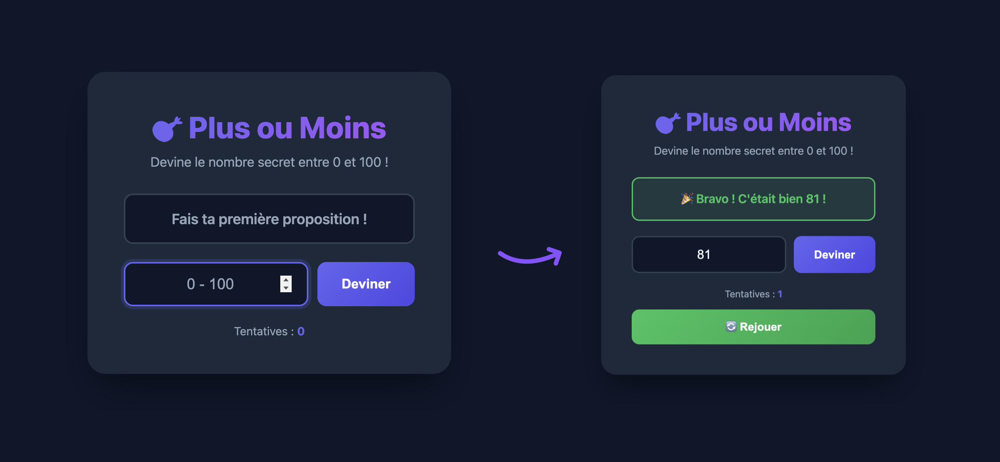

# 🎯 Projet : Le jeu "Plus ou Moins"

## Introduction

Bienvenue dans ton premier projet JavaScript ! 🎉

Tu vas créer un jeu classique : **le jeu du "Plus ou Moins"**. Le principe est simple :
- L'ordinateur choisit secrètement un nombre entre **0 et 100**
- Tu dois deviner ce nombre
- À chaque tentative, l'ordinateur te donne un indice : **"Plus grand !"** ou **"Plus petit !"**
- Tu gagnes quand tu trouves le bon nombre !

### 📸 Aperçu du résultat final

Voici à quoi ressemblera ton jeu une fois terminé :



---

## 📁 Fichiers à créer

Crée un dossier avec ces 3 fichiers :
```
plus-ou-moins/
├── index.html
├── style.css
└── script.js
```

---

## 🎨 Niveau 1 : Le jeu de base (obligatoire)

### Étape 1 : Le CSS (fourni)

📁 **Récupère le fichier [`starter-files/style.css`](starter-files/style.css)** et copie-le dans ton dossier projet.

Ce design est déjà prêt, tu n'as pas besoin de le modifier pour le niveau 1 !

> 💡 **Note** : Les animations `.shake` et `.pulse` en fin de fichier sont prêtes pour le niveau 2 si tu veux les utiliser plus tard !

---

### Étape 2 : La structure HTML

📁 **Récupère le fichier [`starter-files/index.html`](starter-files/index.html)** et copie-le dans ton dossier projet.

Ouvre ce fichier et **complète les 7 TODO** indiqués dans les commentaires :

| TODO | Ce qu'il faut faire |
|------|---------------------|
| **TODO 1** | Relie ton fichier CSS (`style.css`) avec une balise `<link>` |
| **TODO 2** | Crée une `<div>` avec la classe `message-box` et l'id `message` |
| **TODO 3** | Crée un `<input type="number">` avec l'id `guessInput` |
| **TODO 4** | Crée un `<button>` "Deviner" avec l'id `guessBtn` |
| **TODO 5** | Crée un `<p>` pour afficher le compteur de tentatives |
| **TODO 6** | Crée un `<button>` "Rejouer" avec l'id `restartBtn` |
| **TODO 7** | Relie ton fichier JavaScript (`script.js`) avec une balise `<script>` |

> 💡 **Astuce** : Chaque TODO dans le fichier contient un indice avec la syntaxe à utiliser !

---

### 🔍 Étape 2.5 : Vérifie ton HTML !

**Avant de passer au JavaScript**, vérifie que ton HTML est correct :

1. **Ouvre ta page** `index.html` dans ton navigateur (double-clique sur le fichier)
2. **Tu devrais voir** le design s'appliquer (fond sombre, carte centrée, titre en dégradé)
3. **Vérifie** que tous les éléments sont visibles :
   - Le titre "🎯 Plus ou Moins"
   - Le message "Fais ta première proposition !"
   - L'input pour entrer un nombre
   - Le bouton "Deviner"
   - Le texte "Tentatives : 0"

> ⚠️ **Si le design ne s'affiche pas**, vérifie que tu as bien complété le TODO 1 (lien vers le CSS).

> ⚠️ **Si un élément manque**, relis les TODO correspondants et vérifie ta syntaxe HTML.

✅ **Tout est bon ?** Passe à l'étape 3 !

---

### Étape 3 : Le JavaScript — Pas à pas

📁 **Récupère le fichier [`starter-files/script.js`](starter-files/script.js)** et copie-le dans ton dossier projet.

Ce fichier contient tout le code JavaScript avec des TODO à compléter. **Teste ton code après chaque TODO complété !**

---

#### 3.1 — Créer les variables du jeu

Dans le fichier `script.js`, trouve la section `VARIABLES DU JEU` et complète les TODO :

| Variable | Ce qu'elle doit contenir |
|----------|--------------------------|
| `secretNumber` | Un nombre aléatoire entre 0 et 100 |
| `attempts` | Le compteur de tentatives (commence à 0) |
| `gameOver` | `false` (le jeu n'est pas encore terminé) |

> 💡 **Indices pour le nombre aléatoire** :
> - `Math.random()` donne un nombre décimal entre 0 et 1 (ex: 0.7342)
> - Si tu multiplies par 101, tu obtiens un nombre entre 0 et 100.99...
> - `Math.floor()` arrondit vers le bas (enlève les décimales)
> - Combine ces 3 éléments !

💡 **Teste !** Ouvre ta page dans le navigateur, puis ouvre la console (F12 → onglet "Console"). Tu devrais voir le nombre secret affiché. Rafraîchis la page plusieurs fois pour vérifier que le nombre change.


---

#### 3.2 — Récupérer les éléments HTML

Trouve la section `ÉLÉMENTS DU DOM` et remplace les `_____` par les bons IDs :

| Variable | ID à utiliser |
|----------|---------------|
| `guessInput` | L'ID de ton input (TODO 3 du HTML) |
| `guessBtn` | L'ID de ton bouton "Deviner" (TODO 4) |
| `restartBtn` | L'ID de ton bouton "Rejouer" (TODO 6) |
| `messageBox` | L'ID de ta zone de message (TODO 2) |
| `attemptCount` | L'ID de ton span compteur (TODO 5) |

💡 **Teste !** Ajoute `console.log(guessInput);` après ces lignes. Si tu vois `null` dans la console, c'est que l'ID est incorrect.

---

#### 3.3 — Créer la fonction de vérification

Trouve la fonction `checkGuess()` et complète les TODO :

1. **Récupérer la valeur de l'input** : utilise `guessInput.value`
2. **Afficher les messages** : remplace les `"_____"` par tes messages (ex: `"⬆️ Plus grand !"` et `"⬇️ Plus petit !"`)

---

#### 3.4 — Ajouter les événements

Trouve la section `ÉVÉNEMENTS` et complète le TODO :
- Remplace `_____` par le nom de la fonction à appeler quand on clique sur "Deviner"

💡 **Teste !** Tu devrais maintenant pouvoir jouer ! Vérifie que :
- Le message "Plus grand !" ou "Plus petit !" s'affiche
- Le compteur de tentatives augmente
- Quand tu trouves le bon nombre, le message de victoire apparaît

---

#### 3.5 — Créer la fonction "Rejouer"

Trouve la fonction `restartGame()` et complète les TODO :
- Génère un nouveau nombre secret (comme à l'étape 3.1)
- Remet `attempts` à 0
- Remet `gameOver` à `false`
- Ajoute l'événement click sur le bouton rejouer (en bas du fichier)

---

### ✅ Checklist Niveau 1

Avant de passer au niveau 2, vérifie que tout fonctionne :

- [ ] La page s'affiche correctement avec le design (fond sombre, carte centrée)
- [ ] Un nombre aléatoire est généré au chargement (visible dans la console)
- [ ] Je peux entrer un nombre et cliquer sur "Deviner"
- [ ] Le message "Plus grand !" ou "Plus petit !" s'affiche avec les bonnes couleurs
- [ ] Le compteur de tentatives augmente à chaque essai
- [ ] Quand je trouve le bon nombre, un message de victoire apparaît
- [ ] Le bouton "Rejouer" apparaît quand je gagne
- [ ] Le bouton "Rejouer" relance une nouvelle partie (nouveau nombre secret)

🎉 **Félicitations !** Tu as créé ton premier jeu en JavaScript !

---

---

## 🚀 Niveau 2 : Améliorations (bonus)

Tu as terminé le niveau 1 et il te reste du temps ? Super ! Voici des idées pour améliorer ton jeu. 

⚠️ **Attention** : À partir d'ici, tu n'auras plus d'instructions détaillées. C'est à toi de chercher comment faire !

---

### Idées d'améliorations

#### 🎚️ Difficulté : ⭐ (Facile)
- **Afficher l'historique** : Montre la liste de toutes les propositions faites par le joueur
- **Personnaliser les messages** : Change les messages ou ajoute des emojis différents
- **Utiliser les animations CSS** : Ajoute la classe `shake` ou `pulse` à un élément pour l'animer

#### 🎚️ Difficulté : ⭐⭐ (Moyen)
- **Ajouter un slider** : Remplace l'input par un curseur (`<input type="range">`) pour sélectionner le nombre visuellement
- **Limite de tentatives** : Le joueur a seulement 10 essais pour trouver le nombre. S'il échoue, c'est perdu !
- **Indicateur chaud/froid** : Change la couleur de fond selon si le joueur est "chaud" (proche) ou "froid" (loin)

#### 🎚️ Difficulté : ⭐⭐⭐ (Difficile)
- **Choix de difficulté** : Propose plusieurs modes (Facile: 0-50, Normal: 0-100, Difficile: 0-500)
- **Meilleur score** : Enregistre et affiche le record du joueur (nombre minimum de tentatives). Indice : cherche `localStorage`
- **Chronomètre** : Affiche le temps mis pour trouver le nombre

#### 🎨 Personnalisation du design
- Change les couleurs dans le CSS (modifie les variables `--primary`, `--success`, etc.)
- Ajoute des animations personnalisées
- Crée ton propre thème (clair, coloré, néon, rétro...)

---

### Conseils pour le niveau 2

1. **Cherche sur internet** : "JavaScript input range", "JavaScript localStorage", "CSS animation" etc.
2. **Utilise la console** : `console.log()` est ton meilleur ami pour débugger !
3. **Procède par petites étapes** : Fais une amélioration à la fois, teste, puis passe à la suivante
4. **N'aie pas peur de casser ton code** : Tu peux toujours revenir en arrière (Ctrl+Z)
5. **Demande de l'aide** si tu es bloqué(e) plus de 15 minutes sur un problème

---

## 📚 Ressources utiles

- [MDN - Math.random()](https://developer.mozilla.org/fr/docs/Web/JavaScript/Reference/Global_Objects/Math/random)
- [MDN - addEventListener](https://developer.mozilla.org/fr/docs/Web/API/EventTarget/addEventListener)
- [MDN - getElementById](https://developer.mozilla.org/fr/docs/Web/API/Document/getElementById)
- [MDN - Input type range](https://developer.mozilla.org/fr/docs/Web/HTML/Element/input/range)

---

**Bon courage et amuse-toi bien ! 🎮**
