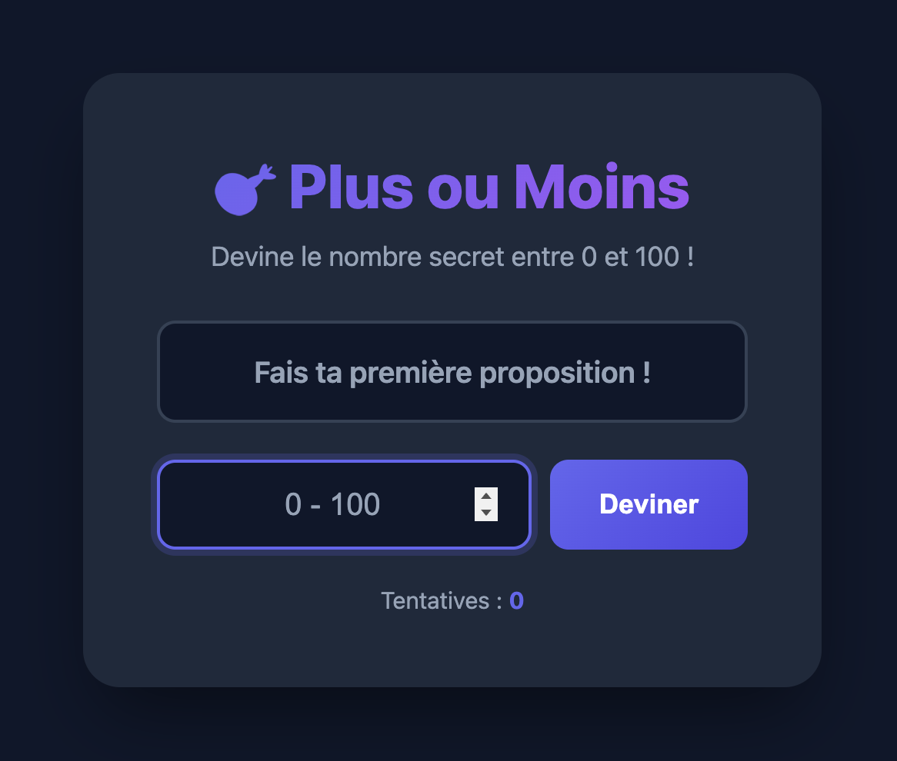
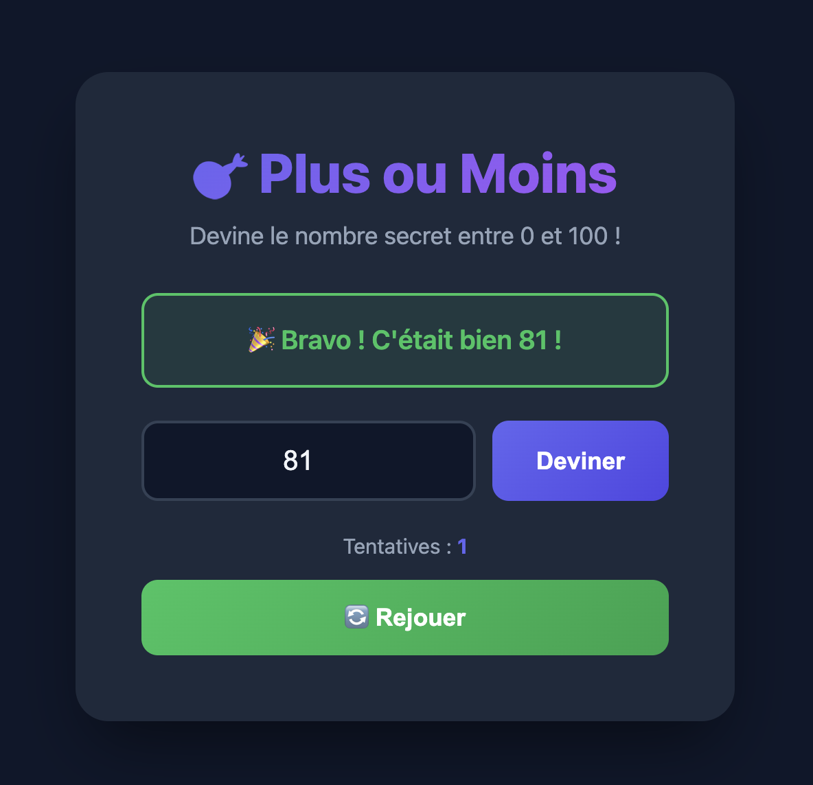

# 🎯 Projet : Le jeu "Plus ou Moins"

## Introduction

Bienvenue dans ton premier projet JavaScript ! 🎉

Tu vas créer un jeu classique : **le jeu du "Plus ou Moins"**. Le principe est simple :
- L'ordinateur choisit secrètement un nombre entre **0 et 100**
- Tu dois deviner ce nombre
- À chaque tentative, l'ordinateur te donne un indice : **"Plus grand !"** ou **"Plus petit !"**
- Tu gagnes quand tu trouves le bon nombre !

### 📸 Aperçu du résultat final

Voici à quoi ressemblera ton jeu une fois terminé :

<!-- TODO: Ajouter une capture d'écran du jeu (état initial) -->


<!-- TODO: Ajouter une capture d'écran du jeu (état victoire) -->


---

## 📁 Fichiers à créer

Crée un dossier avec ces 3 fichiers :
```
plus-ou-moins/
├── index.html
├── style.css
└── script.js
```

---

## 🎨 Niveau 1 : Le jeu de base (obligatoire)

### Étape 1 : Le CSS (fourni)

Copie-colle ce code dans ton fichier `style.css`. Ce design est déjà prêt, tu n'as pas besoin de le modifier pour le niveau 1 !

> 💡 **Note** : Les animations `.shake` et `.pulse` en fin de fichier sont prêtes pour le niveau 2 si tu veux les utiliser plus tard !

```css
/* =========================
   VARIABLES & RESET
   ========================= */

:root {
  --primary: #6366f1;
  --primary-dark: #4f46e5;
  --success: #22c55e;
  --warning: #f59e0b;
  --bg: #0f172a;
  --bg-card: #1e293b;
  --text: #f1f5f9;
  --text-muted: #94a3b8;
  --border: #334155;
}

* {
  margin: 0;
  padding: 0;
  box-sizing: border-box;
}

body {
  font-family: 'Segoe UI', system-ui, sans-serif;
  background: var(--bg);
  color: var(--text);
  min-height: 100vh;
  display: flex;
  justify-content: center;
  align-items: center;
  padding: 20px;
}

/* =========================
   CONTAINER PRINCIPAL
   ========================= */

.game-container {
  background: var(--bg-card);
  border-radius: 24px;
  padding: 48px;
  width: 100%;
  max-width: 480px;
  box-shadow: 0 25px 50px -12px rgba(0, 0, 0, 0.5);
  text-align: center;
}

/* =========================
   TITRE & DESCRIPTION
   ========================= */

.game-title {
  font-size: 2.5rem;
  font-weight: 800;
  margin-bottom: 8px;
  background: linear-gradient(135deg, var(--primary), #a855f7);
  -webkit-background-clip: text;
  -webkit-text-fill-color: transparent;
  background-clip: text;
}

.game-description {
  color: var(--text-muted);
  margin-bottom: 32px;
  font-size: 1.1rem;
}

/* =========================
   ZONE DE SAISIE
   ========================= */

.input-group {
  display: flex;
  gap: 12px;
  margin-bottom: 24px;
}

.guess-input {
  flex: 1;
  padding: 16px 20px;
  font-size: 1.25rem;
  border: 2px solid var(--border);
  border-radius: 12px;
  background: var(--bg);
  color: var(--text);
  text-align: center;
  transition: border-color 0.2s, box-shadow 0.2s;
}

.guess-input:focus {
  outline: none;
  border-color: var(--primary);
  box-shadow: 0 0 0 4px rgba(99, 102, 241, 0.2);
}

.guess-input::placeholder {
  color: var(--text-muted);
}

/* =========================
   BOUTONS
   ========================= */

.btn {
  padding: 16px 32px;
  font-size: 1.1rem;
  font-weight: 600;
  border: none;
  border-radius: 12px;
  cursor: pointer;
  transition: transform 0.15s, box-shadow 0.15s;
}

.btn:hover {
  transform: translateY(-2px);
  box-shadow: 0 8px 20px rgba(0, 0, 0, 0.3);
}

.btn:active {
  transform: translateY(0);
}

.btn-primary {
  background: linear-gradient(135deg, var(--primary), var(--primary-dark));
  color: white;
}

.btn-success {
  background: linear-gradient(135deg, var(--success), #16a34a);
  color: white;
  width: 100%;
  margin-top: 16px;
}

/* =========================
   ZONE DE MESSAGE
   ========================= */

.message-box {
  padding: 20px;
  border-radius: 12px;
  margin-bottom: 24px;
  font-size: 1.2rem;
  font-weight: 600;
  min-height: 64px;
  display: flex;
  align-items: center;
  justify-content: center;
  background: var(--bg);
  border: 2px solid var(--border);
  color: var(--text-muted);
}

.message-box.hint-higher {
  border-color: var(--warning);
  color: var(--warning);
  background: rgba(245, 158, 11, 0.1);
}

.message-box.hint-lower {
  border-color: var(--primary);
  color: var(--primary);
  background: rgba(99, 102, 241, 0.1);
}

.message-box.win {
  border-color: var(--success);
  color: var(--success);
  background: rgba(34, 197, 94, 0.1);
}

/* =========================
   COMPTEUR DE TENTATIVES
   ========================= */

.attempts {
  color: var(--text-muted);
  font-size: 0.95rem;
  margin-top: 16px;
}

.attempts span {
  color: var(--primary);
  font-weight: 700;
}

/* =========================
   BOUTON REJOUER (caché par défaut)
   ========================= */

.btn-restart {
  display: none;
}

.btn-restart.visible {
  display: block;
}

/* =========================
   ANIMATIONS (pour le niveau 2)
   ========================= */

@keyframes shake {
  0%, 100% { transform: translateX(0); }
  25% { transform: translateX(-5px); }
  75% { transform: translateX(5px); }
}

@keyframes pulse {
  0%, 100% { transform: scale(1); }
  50% { transform: scale(1.05); }
}

.shake {
  animation: shake 0.3s ease-in-out;
}

.pulse {
  animation: pulse 0.5s ease-in-out;
}
```

---

### Étape 2 : La structure HTML

Copie ce code dans `index.html` et **complète les TODO** :

```html
<!DOCTYPE html>
<html lang="fr">
<head>
  <meta charset="UTF-8">
  <meta name="viewport" content="width=device-width, initial-scale=1.0">
  <title>Plus ou Moins</title>
  <!-- TODO 1: Relie ton fichier CSS (style.css) -->
  <!-- Indice: <link rel="stylesheet" href="..."> -->
  
</head>
<body>

  <div class="game-container">
    
    <h1 class="game-title">🎯 Plus ou Moins</h1>
    <p class="game-description">Devine le nombre secret entre 0 et 100 !</p>

    <!-- Zone de message -->
    <!-- TODO 2: Crée une div avec la classe "message-box" et l'id "message" -->
    <!-- Le texte par défaut sera : "Fais ta première proposition !" -->
    <!-- Indice: <div class="..." id="...">Texte ici</div> -->
    
    
    <!-- Zone de saisie -->
    <div class="input-group">
      <!-- TODO 3: Crée un input de type "number" avec :
           - l'id "guessInput"
           - la classe "guess-input"
           - min="0" et max="100"
           - placeholder="0 - 100"
      -->
      <!-- Indice: <input type="number" id="..." class="..." min="..." max="..." placeholder="..."> -->
      
      
      <!-- TODO 4: Crée un bouton avec :
           - l'id "guessBtn"
           - les classes "btn btn-primary"
           - le texte "Deviner"
      -->
      <!-- Indice: <button id="..." class="...">Texte</button> -->
      
    </div>

    <!-- Compteur de tentatives -->
    <!-- TODO 5: Crée un paragraphe avec la classe "attempts" qui affiche :
         "Tentatives : " suivi d'un <span> avec l'id "attemptCount" contenant "0"
    -->
    <!-- Indice: <p class="...">Tentatives : <span id="...">0</span></p> -->
    

    <!-- Bouton rejouer (caché par défaut) -->
    <!-- TODO 6: Crée un bouton avec :
         - l'id "restartBtn"
         - les classes "btn btn-success btn-restart"
         - le texte "🔄 Rejouer"
    -->
    <!-- Indice: <button id="..." class="...">Texte</button> -->
    

  </div>

  <!-- TODO 7: Relie ton fichier JavaScript (script.js) -->
  <!-- Indice: <script src="..."></script> -->
  
</body>
</html>
```

---

### 🔍 Étape 2.5 : Vérifie ton HTML !

**Avant de passer au JavaScript**, vérifie que ton HTML est correct :

1. **Ouvre ta page** `index.html` dans ton navigateur (double-clique sur le fichier)
2. **Tu devrais voir** le design s'appliquer (fond sombre, carte centrée, titre en dégradé)
3. **Vérifie** que tous les éléments sont visibles :
   - Le titre "🎯 Plus ou Moins"
   - Le message "Fais ta première proposition !"
   - L'input pour entrer un nombre
   - Le bouton "Deviner"
   - Le texte "Tentatives : 0"

> ⚠️ **Si le design ne s'affiche pas**, vérifie que tu as bien complété le TODO 1 (lien vers le CSS).

> ⚠️ **Si un élément manque**, relis les TODO correspondants et vérifie ta syntaxe HTML.

✅ **Tout est bon ?** Passe à l'étape 3 !

---

### Étape 3 : Le JavaScript — Pas à pas

Ouvre ton fichier `script.js` et suis les étapes suivantes. **Teste ton code après chaque étape !**

---

#### 3.1 — Créer les variables du jeu

```javascript
// ===== VARIABLES DU JEU =====

// Le nombre secret que l'ordinateur a choisi (entre 0 et 100)
// TODO: Génère un nombre aléatoire entre 0 et 100
//
// Indices :
// - Math.random() donne un nombre décimal entre 0 et 1 (ex: 0.7342)
// - Si tu multiplies par 101, tu obtiens un nombre entre 0 et 100.99...
// - Math.floor() arrondit vers le bas (enlève les décimales)
// - Combine ces 3 éléments !
let secretNumber = _____;

// Le nombre de tentatives du joueur (commence à 0)
let attempts = _____;

// Pour savoir si le jeu est terminé (true = terminé, false = en cours)
let gameOver = _____;

// Affiche le nombre secret dans la console (pour tester)
console.log("🤫 Le nombre secret est :", secretNumber);
```

💡 **Teste !** Ouvre ta page dans le navigateur, puis ouvre la console (F12 ou "Clic droit > Inspecter", puis aller dans l'onglet "Console"). Tu devrais voir le nombre secret affiché. Rafraîchis la page plusieurs fois pour vérifier que le nombre change.

<!-- TODO: Ajouter une capture d'écran de la console avec le nombre secret -->


---

#### 3.2 — Récupérer les éléments HTML

Pour que JavaScript puisse interagir avec ta page, il faut d'abord "récupérer" les éléments HTML.

```javascript
// ===== ÉLÉMENTS DU DOM =====

// TODO: Récupère les éléments HTML avec document.getElementById()
// Remplace les _____ par les IDs que tu as mis dans ton HTML

const guessInput = document.getElementById("_____");   // L'input où on tape le nombre
const guessBtn = document.getElementById("_____");     // Le bouton "Deviner"
const restartBtn = document.getElementById("_____");   // Le bouton "Rejouer"
const messageBox = document.getElementById("_____");   // La zone de message
const attemptCount = document.getElementById("_____"); // Le compteur de tentatives
```

💡 **Astuce :** Les IDs correspondent à ceux que tu as définis dans le HTML aux TODO 2 à 6.

💡 **Teste !** Ajoute `console.log(guessInput);` après ces lignes. Si tu vois `null` dans la console, c'est que l'ID est incorrect.

---

#### 3.3 — Créer la fonction de vérification

C'est la fonction principale du jeu ! Elle compare la proposition du joueur avec le nombre secret.

```javascript
// ===== FONCTION DE VÉRIFICATION =====

function checkGuess() {
  // Si le jeu est terminé, on ne fait rien
  if (gameOver) {
    return;
  }

  // TODO: Récupère la valeur de l'input et convertis-la en nombre
  // Indice: guessInput.value contient le texte tapé par l'utilisateur
  // Indice: parseInt() convertit du texte en nombre entier
  let playerGuess = parseInt(_____);

  // Vérifie si le joueur a bien entré un nombre
  if (isNaN(playerGuess)) {
    messageBox.textContent = "Entre un nombre valide !";
    return;
  }

  // On augmente le compteur de tentatives
  attempts = attempts + 1;
  attemptCount.textContent = attempts;

  // TODO: Compare playerGuess avec secretNumber et affiche le bon message
  //
  // Si playerGuess < secretNumber → le joueur doit deviner PLUS GRAND
  // Si playerGuess > secretNumber → le joueur doit deviner PLUS PETIT
  // Sinon → le joueur a GAGNÉ !

  if (playerGuess < secretNumber) {
    // Le nombre proposé est trop petit
    // TODO: Remplace _____ par le message à afficher (ex: "⬆️ Plus grand !")
    messageBox.textContent = "_____";
    messageBox.className = "message-box hint-higher";
  } 
  else if (playerGuess > secretNumber) {
    // Le nombre proposé est trop grand
    // TODO: Remplace _____ par le message à afficher (ex: "⬇️ Plus petit !")
    messageBox.textContent = "_____";
    messageBox.className = "message-box hint-lower";
  } 
  else {
    // Gagné !
    messageBox.textContent = "🎉 Bravo ! C'était bien " + secretNumber + " !";
    messageBox.className = "message-box win";
    
    // Le jeu est terminé
    gameOver = true;
    
    // On affiche le bouton rejouer
    restartBtn.classList.add("visible");
    
    // On désactive l'input et le bouton deviner
    guessInput.disabled = true;
    guessBtn.disabled = true;
  }
}
```

---

#### 3.4 — Ajouter les événements

Maintenant, il faut dire à JavaScript **quand** appeler la fonction `checkGuess()`.

```javascript
// ===== ÉVÉNEMENTS =====

// TODO: Quand on clique sur le bouton "Deviner", on appelle checkGuess()
// Remplace _____ par le nom de la fonction à appeler
guessBtn.addEventListener("click", _____);

// BONUS: Quand on appuie sur Entrée dans l'input, on appelle aussi checkGuess()
guessInput.addEventListener("keypress", function(event) {
  if (event.key === "Enter") {
    checkGuess();
  }
});
```

💡 **Teste !** Tu devrais maintenant pouvoir jouer ! Entre un nombre et clique sur "Deviner". Vérifie que :
- Le message "Plus grand !" ou "Plus petit !" s'affiche
- Le compteur de tentatives augmente
- Quand tu trouves le bon nombre, le message de victoire apparaît

---

#### 3.5 — Créer la fonction "Rejouer"

Dernière étape ! On veut pouvoir recommencer une partie.

```javascript
// ===== FONCTION REJOUER =====

function restartGame() {
  // TODO: Génère un nouveau nombre secret (comme à l'étape 3.1)
  secretNumber = _____;
  
  // TODO: Remet le compteur de tentatives à 0
  attempts = _____;
  attemptCount.textContent = attempts;  // On affiche la nouvelle valeur de attempts
  
  // TODO: Remet gameOver à false (le jeu n'est plus terminé)
  gameOver = _____;
  
  // Réinitialise l'affichage
  messageBox.textContent = "Fais ta première proposition !";
  messageBox.className = "message-box";
  
  // Réactive l'input et le bouton
  guessInput.disabled = false;
  guessBtn.disabled = false;
  guessInput.value = "";
  guessInput.focus();
  
  // Cache le bouton rejouer
  restartBtn.classList.remove("visible");
  
  // Affiche le nouveau nombre secret dans la console (pour tester)
  console.log("🤫 Nouveau nombre secret :", secretNumber);
}

// TODO: Ajoute un événement click sur le bouton rejouer
// (même principe qu'à l'étape 3.4)
restartBtn.addEventListener("click", _____);
```

---

### ✅ Checklist Niveau 1

Avant de passer au niveau 2, vérifie que tout fonctionne :

- [ ] La page s'affiche correctement avec le design (fond sombre, carte centrée)
- [ ] Un nombre aléatoire est généré au chargement (visible dans la console)
- [ ] Je peux entrer un nombre et cliquer sur "Deviner"
- [ ] Le message "Plus grand !" ou "Plus petit !" s'affiche avec les bonnes couleurs
- [ ] Le compteur de tentatives augmente à chaque essai
- [ ] Quand je trouve le bon nombre, un message de victoire apparaît
- [ ] Le bouton "Rejouer" apparaît quand je gagne
- [ ] Le bouton "Rejouer" relance une nouvelle partie (nouveau nombre secret)

🎉 **Félicitations !** Tu as créé ton premier jeu en JavaScript !

---

---

## 🚀 Niveau 2 : Améliorations (bonus)

Tu as terminé le niveau 1 et il te reste du temps ? Super ! Voici des idées pour améliorer ton jeu. 

⚠️ **Attention** : À partir d'ici, tu n'auras plus d'instructions détaillées. C'est à toi de chercher comment faire !

---

### Idées d'améliorations

#### 🎚️ Difficulté : ⭐ (Facile)
- **Afficher l'historique** : Montre la liste de toutes les propositions faites par le joueur
- **Personnaliser les messages** : Change les messages ou ajoute des emojis différents
- **Utiliser les animations CSS** : Ajoute la classe `shake` ou `pulse` à un élément pour l'animer

#### 🎚️ Difficulté : ⭐⭐ (Moyen)
- **Ajouter un slider** : Remplace l'input par un curseur (`<input type="range">`) pour sélectionner le nombre visuellement
- **Limite de tentatives** : Le joueur a seulement 10 essais pour trouver le nombre. S'il échoue, c'est perdu !
- **Indicateur chaud/froid** : Change la couleur de fond selon si le joueur est "chaud" (proche) ou "froid" (loin)

#### 🎚️ Difficulté : ⭐⭐⭐ (Difficile)
- **Choix de difficulté** : Propose plusieurs modes (Facile: 0-50, Normal: 0-100, Difficile: 0-500)
- **Meilleur score** : Enregistre et affiche le record du joueur (nombre minimum de tentatives). Indice : cherche `localStorage`
- **Chronomètre** : Affiche le temps mis pour trouver le nombre

#### 🎨 Personnalisation du design
- Change les couleurs dans le CSS (modifie les variables `--primary`, `--success`, etc.)
- Ajoute des animations personnalisées
- Crée ton propre thème (clair, coloré, néon, rétro...)

---

### Conseils pour le niveau 2

1. **Cherche sur internet** : "JavaScript input range", "JavaScript localStorage", "CSS animation" etc.
2. **Utilise la console** : `console.log()` est ton meilleur ami pour débugger !
3. **Procède par petites étapes** : Fais une amélioration à la fois, teste, puis passe à la suivante
4. **N'aie pas peur de casser ton code** : Tu peux toujours revenir en arrière (Ctrl+Z)
5. **Demande de l'aide** si tu es bloqué(e) plus de 15 minutes sur un problème

---

## 📚 Ressources utiles

- [MDN - Math.random()](https://developer.mozilla.org/fr/docs/Web/JavaScript/Reference/Global_Objects/Math/random)
- [MDN - addEventListener](https://developer.mozilla.org/fr/docs/Web/API/EventTarget/addEventListener)
- [MDN - getElementById](https://developer.mozilla.org/fr/docs/Web/API/Document/getElementById)
- [MDN - Input type range](https://developer.mozilla.org/fr/docs/Web/HTML/Element/input/range)

---

**Bon courage et amuse-toi bien ! 🎮**
