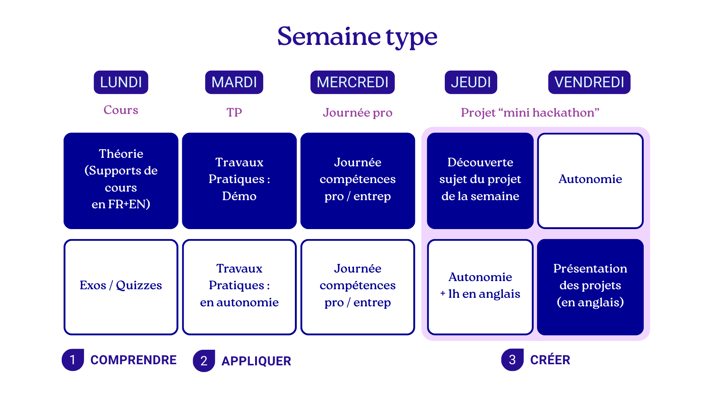

# Organisation pédagogique — Semaine type

Cette semaine type est construite selon une progression pédagogique volontairement structurée, allant de l’acquisition des concepts à leur mise en œuvre concrète, puis à la création autonome.  
Elle repose sur une logique en trois temps : **comprendre → appliquer → créer**.

## Lundi — Comprendre (Cours)

La journée du lundi est consacrée à l’acquisition des bases théoriques.

- **Cours théoriques**
  - Supports de cours fournis en français et en anglais.
  - Introduction des notions clés nécessaires pour la suite de la semaine.
- **Exercices et quizzes**
  - Vérification de la compréhension des concepts.
  - Premières mises en pratique simples, guidées.

Objectif principal : poser un cadre conceptuel clair et partagé.

## Mardi — Appliquer (Travaux pratiques)

Le mardi est dédié à la mise en œuvre concrète des notions vues la veille.

- **Travaux pratiques avec démonstration**
  - Présentation pas à pas des méthodes et outils.
  - Illustration des bonnes pratiques.
- **Travaux pratiques en autonomie**
  - Application individuelle ou en petits groupes.
  - Consolidation des acquis par la pratique.

Objectif principal : transformer la théorie en compétences opérationnelles.

## Mercredi — Compétences professionnelles et entrepreneuriat

Le mercredi marque une rupture volontaire avec le pur technique.

- **Journée compétences professionnelles / entrepreneuriat**
  - Méthodes de travail, posture professionnelle.
  - Gestion de projet, communication, organisation.
  - Sensibilisation aux réalités du monde professionnel et entrepreneurial.

Objectif principal : développer les compétences transversales nécessaires à l’insertion professionnelle.

## Jeudi & Vendredi — Créer (Projet “mini hackathon”)

Les deux derniers jours de la semaine sont consacrés à un projet fil rouge, sur un format proche d’un mini hackathon.

### Jeudi — Lancement et production
- **Découverte du sujet du projet de la semaine**
  - Présentation du contexte et des objectifs.
- **Travail en autonomie**
  - Conception et développement des premières fonctionnalités.
- **Autonomie + 1 heure en anglais**
  - Travail technique et préparation à l’expression orale en anglais.

### Vendredi — Finalisation et restitution
- **Travail en autonomie**
  - Finalisation du projet.
- **Présentation des projets (en anglais)**
  - Restitution orale.
  - Travail sur la clarté, la structuration et la communication.

Objectif principal : mobiliser l’ensemble des compétences acquises pour produire, présenter et défendre un projet.

## Synthèse pédagogique

- **1 — Comprendre** : Lundi  
- **2 — Appliquer** : Mardi  
- **3 — Créer** : Jeudi & Vendredi  

Cette organisation vise à installer un rythme stable, lisible et progressif, tout en favorisant l’autonomie, la pratique et la professionnalisation.